# 🤖 FreelanceOS AI CRM v2


> **An AI-powered CRM Automation Platform that manages client leads, automates follow-ups, generates business insights, and provides an intelligent CRM Copilot using n8n, Gemini AI, Gmail, Google Sheets, and Telegram.**

---

# 🚀 Overview

FreelanceOS AI CRM v2 is the second and final evolution of the FreelanceOS AI CRM project.

While Version 1 automated client email analysis and follow-up management, Version 2 expands the platform into a complete AI-powered CRM ecosystem consisting of four integrated automation workflows.

The platform can:

- Analyze incoming client inquiries using AI
- Detect duplicate CRM entries
- Score and categorize business opportunities
- Schedule automated follow-ups
- Generate professional Gmail draft replies
- Send Telegram notifications
- Generate AI-powered business insights
- Answer CRM questions using an AI Copilot (RAG)

The goal of this project is to reduce repetitive manual work while helping freelancers and small businesses manage client relationships more efficiently.

---

# 🚀 Evolution from Version 1

FreelanceOS AI CRM began as an AI workflow that automated email analysis and follow-up reminders.

Version 2 significantly expands the original project by introducing several new capabilities.

### ✅ Version 1

- AI Email Analysis
- Gmail Draft Generation
- Google Sheets CRM
- Follow-up Automation

### 🚀 Version 2

- AI Lead Processing Pipeline
- Duplicate Lead Detection
- AI Dashboard & Business Insights
- Executive Business Reports
- Telegram Notifications
- AI CRM Copilot (RAG)
- Natural Language CRM Search
- Sales Recommendations
- Business Risk Analysis

Version 2 transforms FreelanceOS AI CRM from a simple workflow automation into a complete AI-powered CRM platform.

---

# ❗ Problem

Freelancers often receive numerous client inquiries across email.

Managing these conversations manually leads to:

- Missed follow-ups
- Duplicate client records
- Slow response times
- Poor lead organization
- Lack of business insights
- Difficulty tracking high-value opportunities

---

# 💡 Solution

FreelanceOS AI CRM v2 automates the complete client management process.

Incoming emails are analyzed using AI, business information is extracted, duplicate records are detected, leads are categorized, follow-ups are scheduled automatically, Gmail draft replies are generated, Telegram alerts are sent, business reports are created, and an AI Copilot allows users to query CRM data using natural language.

---

# ✨ Features

## 📥 AI Lead Processing Pipeline

- Reads incoming Gmail inquiries
- AI-powered lead analysis
- Duplicate lead detection
- Business opportunity scoring
- Lead temperature classification
- Client information extraction
- Automatic CRM updates
- Follow-up scheduling
- Gmail draft generation
- Telegram notifications

---

## 📅 AI Follow-up Automation

Runs automatically every day.

Features include:

- Reads pending follow-ups
- Checks follow-up due dates
- Generates Gmail reply drafts
- Updates follow-up status
- Prevents missed client communication

---

## 📊 AI Dashboard & Business Insights

Automatically generates business analytics including:

- Executive Summary
- Business Risks
- AI Recommendations
- Lead Distribution
- Lead Statistics
- Follow-up Metrics
- Potential Revenue Analysis

All insights are stored inside Google Sheets.

---

## 🤖 AI CRM Copilot (RAG)

Natural language assistant capable of answering CRM questions.

Examples include:

- Who has the highest opportunity score?
- Give today's CRM summary.
- Which clients requested meetings?
- Who needs follow-up tomorrow?
- What are your recommendations to improve sales?

The Copilot retrieves CRM records and AI-generated insights before responding.

---

# 🛠️ Tech Stack

| Technology | Purpose |
|------------|---------|
| n8n | Workflow Automation |
| Gemini 2.0 Flash | AI Analysis |
| Gmail API | Email Automation |
| Google Sheets | CRM Database |
| Telegram Bot API | Notifications |
| Structured Output Parser | AI Data Formatting |
| JSON | Workflow Export |

---

## Key Engineering Concepts

- Event-driven workflow automation
- API integrations
- AI-powered data processing
- Structured data extraction
- Retrieval-Augmented Generation (RAG)
- Duplicate detection logic
- Automated scheduling
- Business analytics generation

# 📂 Project Structure

```text
FreelanceOS-AI-CRM-v2
│
├── assets/
│
├── workflows/
│   ├── ai-lead-processing-pipeline-v2.json
│   ├── ai-follow-up-automation.json
│   ├── ai-dashboard-business-insights-v2.json
│   └── freelanceos-ai-copilot-rag.json
│
├── LICENSE
└── README.md
```

---

# ⚙️ Workflow Architecture

## 📥 AI Lead Processing

Incoming Gmail

↓

Gemini AI Analysis

↓

Duplicate Detection

↓

Update Existing Lead / Create New Lead

↓

Schedule Follow-up

↓

Generate Gmail Draft

↓

Telegram Notification

---

## 📅 AI Follow-up

Daily Scheduler

↓

Pending Follow-ups

↓

Due Date Verification

↓

Generate Gmail Draft

↓

Update Status

---

## 📊 AI Dashboard

Read CRM

↓

Generate Metrics

↓

Gemini AI

↓

Executive Summary

↓

Store AI Insights

---

## 🤖 AI CRM Copilot

User Question

↓

Retrieve CRM Database

↓

Retrieve Follow-up Database

↓

Retrieve AI Insights

↓

Combine Context

↓

Gemini AI

↓

Natural Language Response

---

# 🚀 Getting Started

1. Clone this repository.

2. Import all workflow JSON files into n8n.

3. Configure credentials:

- Gmail
- Gemini API
- Google Sheets
- Telegram

4. Update Spreadsheet IDs.

5. Execute the workflows.

---

# 📸 Screenshots

## 📥 AI Lead Processing Pipeline

### New Lead Flow

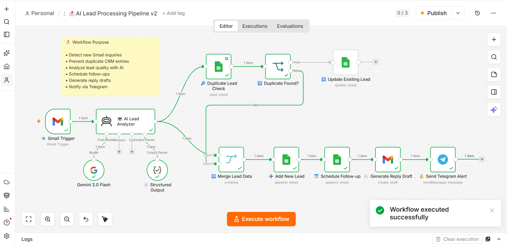

### Existing Lead Detection

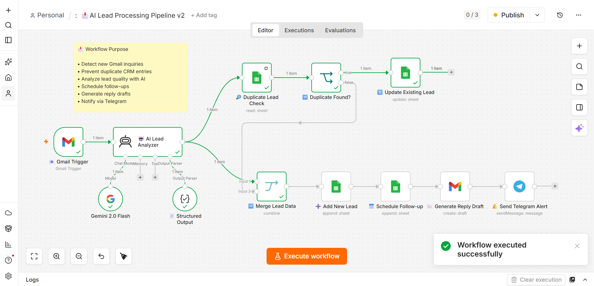

---

## 📅 AI Follow-up Automation

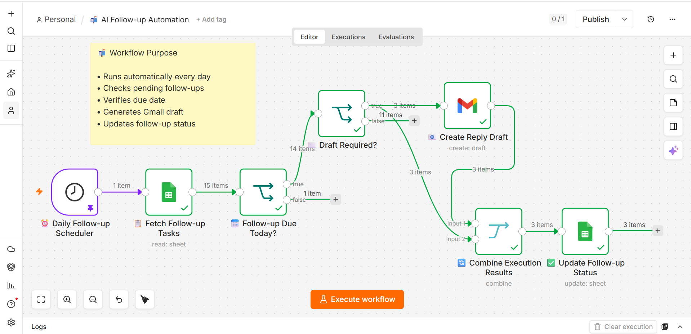

---

## ✉️ Gmail Draft Generation

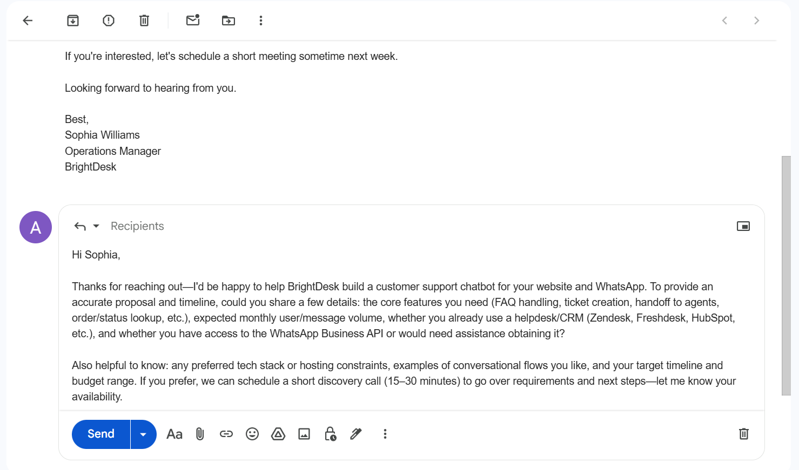

---

## 📲 Telegram Notifications

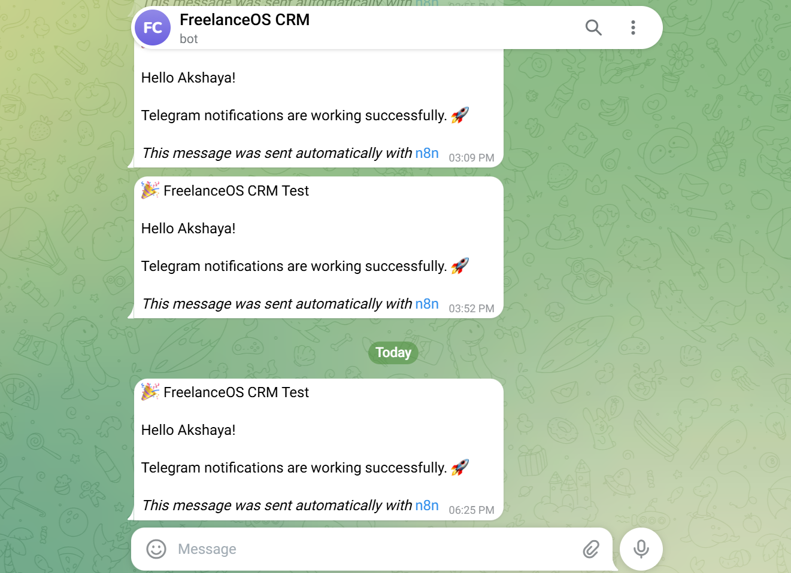

---

## 📊 AI Dashboard & Business Insights

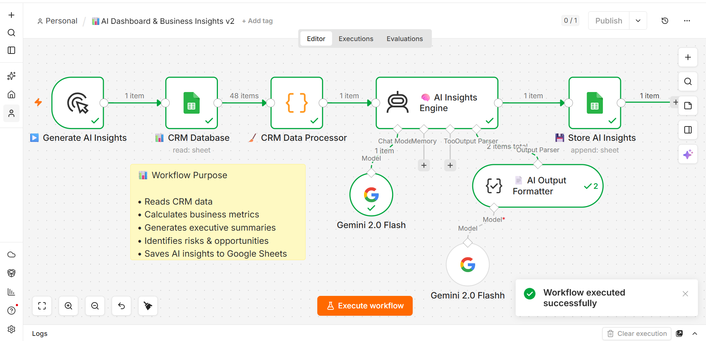

---

## 📈 CRM Dashboard

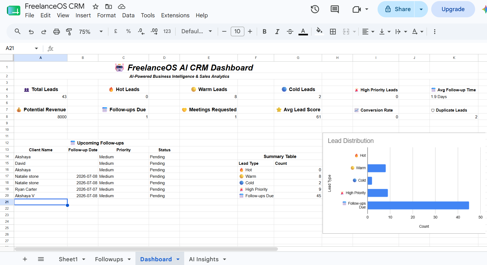

---

## 🧠 AI Insights Sheet

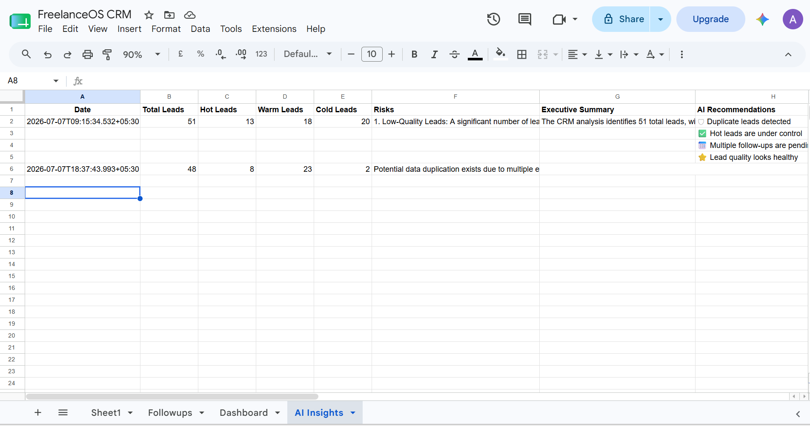

---

## 🤖 AI CRM Copilot (RAG)

### Workflow

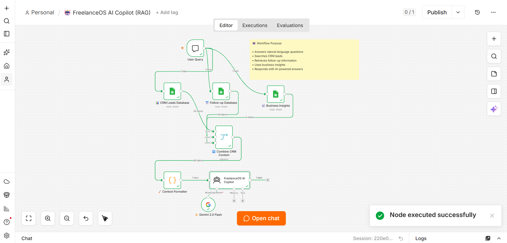

### Chat Example 1

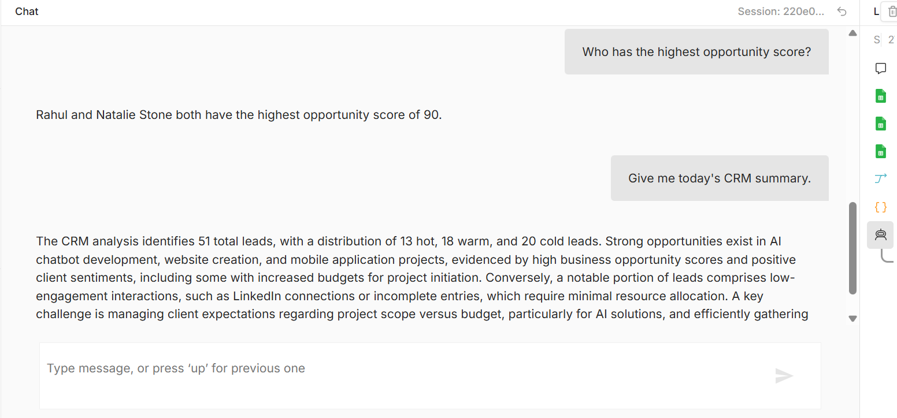

### Chat Example 2

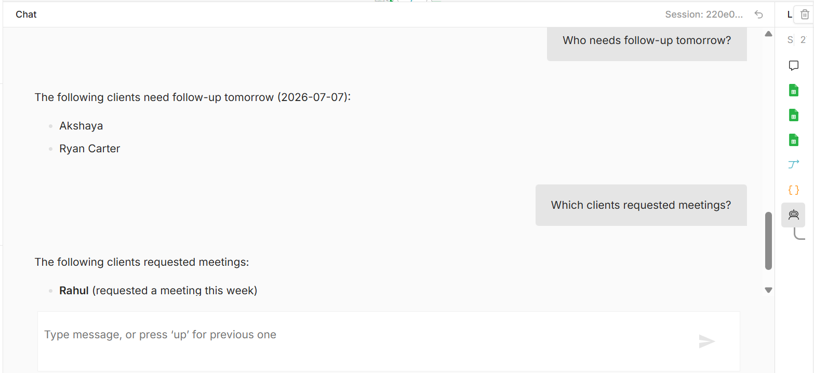

### Chat Example 3

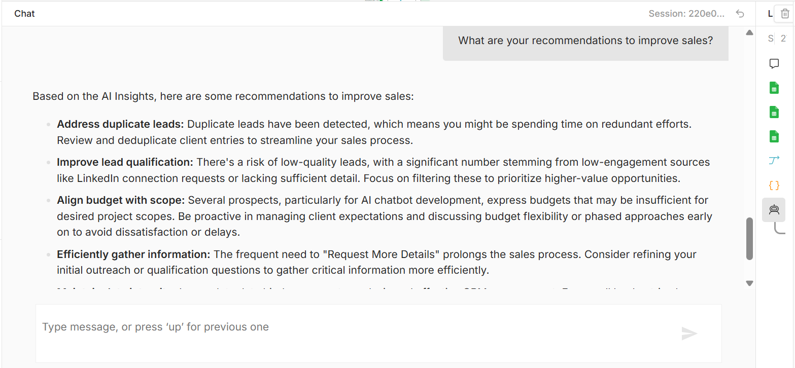

---

# 🎯 Key Achievements

✅ Four integrated AI workflows

✅ Duplicate lead detection

✅ Automated follow-up management

✅ AI-generated Gmail drafts

✅ Telegram notifications

✅ Executive business insights

✅ Natural language CRM assistant (RAG)

✅ Google Sheets CRM dashboard

---

# 👩‍💻 Author

## Akshaya V

Computer Science Undergraduate passionate about building AI-powered applications, workflow automation, and scalable software solutions.

Currently expanding my skills in:

- 🤖 Artificial Intelligence
- ⚙️ Workflow Automation
- 💻 Software Development
- 🌐 Full Stack Development
- 📊 Backend Systems
- 📈 Problem Solving & Data Structures (C++)
- 🚀 Aspiring Software Development Engineer (SDE)

**GitHub**

https://github.com/akshayav316

**LinkedIn**

https://www.linkedin.com/in/akshaya-v-0199233ab/

# 📄 License

This project is licensed under the MIT License.

---

⭐ **If you found this project interesting, consider giving it a star!**
